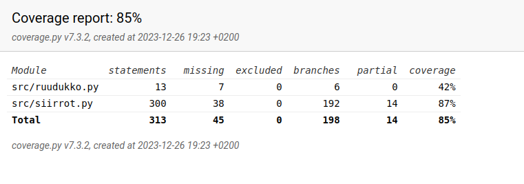

# Testausdokumentti

Pelin eri funktioita in testattu yksikkötesteillä. Lisäksi minmaxin avulla parhaan siirron valintaa on testattu muutamassa erilaisessa tilanteessa. Testit tehtiin syöttämällä ruudukkoon valmiiksi tilanne, josta tiedetään mikä oletettava paras siirto olisi. Tätä parasta siirtoa verrataan ohjelman päättelemään parhaaseen siirtoon.

Ruudukon tulostusta ja itse pelisilmukkaa ei voi helposti testata yksikkötesteillä, joten ne vaikuttavat testikattavuuteen.